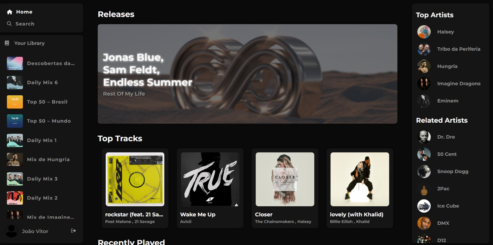
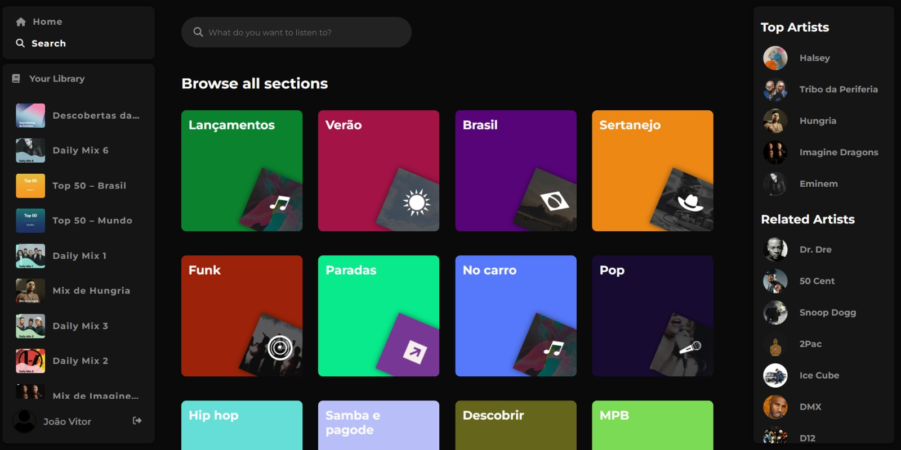
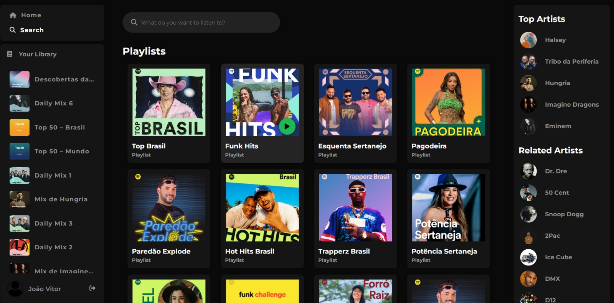
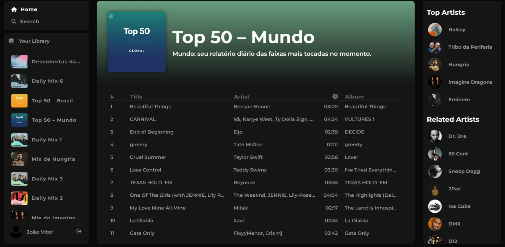

# Projeto Clone do Spotify

Este é um projeto de clone do Spotify desenvolvido em Angular. Ele permite que os usuários visualizem seus artistas preferidos, suas faixas mais ouvidas, playlists favoritas e também realizem pesquisas de músicas e playlists.


## Capturas de Tela

### Página Inicial

*Legenda: Captura de tela da página inicial*

### Página de Busca

*Legenda: Captura de tela da página de busca*

### Busca de Playlists

*Legenda: Captura de tela da busca de playlists*

### Playlist

*Legenda: Captura de tela de uma playlist*


## Instalação

1. Clone este repositório:
``` bash
git clone https://github.com/jvittor1/SpotifyClone.git
```
2. Instale as dependências:
```bash 
npm install
```

## Configuração de Variáveis

Antes de começar, você precisará realizar algumas etapas de configuração:

1. Faça login no [Spotify Developer Dashboard](https://developer.spotify.com/) e crie um novo aplicativo.
2. Configure corretamente as variáveis de ambiente presentes nos arquivos `enviroments/enviroment.prod.ts` e `enviroments/enviroment.ts`. Insira as informações fornecidas pelo Spotify Developer Dashboard.

```typescript
// enviroments/enviroment.prod.ts
export const spotifyConfig = {
    clientId: 'CLIENT_ID',
    authEndpoint: 'AUTH_END_POINT',
    redirectUri: 'REDIRECT_URL',
};
```

```typescript
// enviroments/enviroment.ts
export const spotifyConfig = {
    clientId: 'CLIENT_ID',
    authEndpoint: 'AUTH_END_POINT',
    redirectUri: 'REDIRECT_URL',
};
```

## Executando a Aplicação
Execute o seguinte comando para iniciar a aplicação:

```bash 
ng serve
```
Acesse http://localhost:4200/ em seu navegador para visualizar o projeto.

## Funcionalidades

O projeto possui as seguintes funcionalidades:

- Visualizar artistas preferidos.
- Visualizar faixas mais ouvidas.
- Visualizar playlists favoritas.
- Pesquisar músicas e playlists.

## Autores

- [João Vitor](https://github.com/jvittor1)